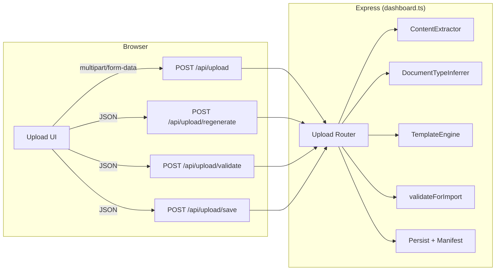
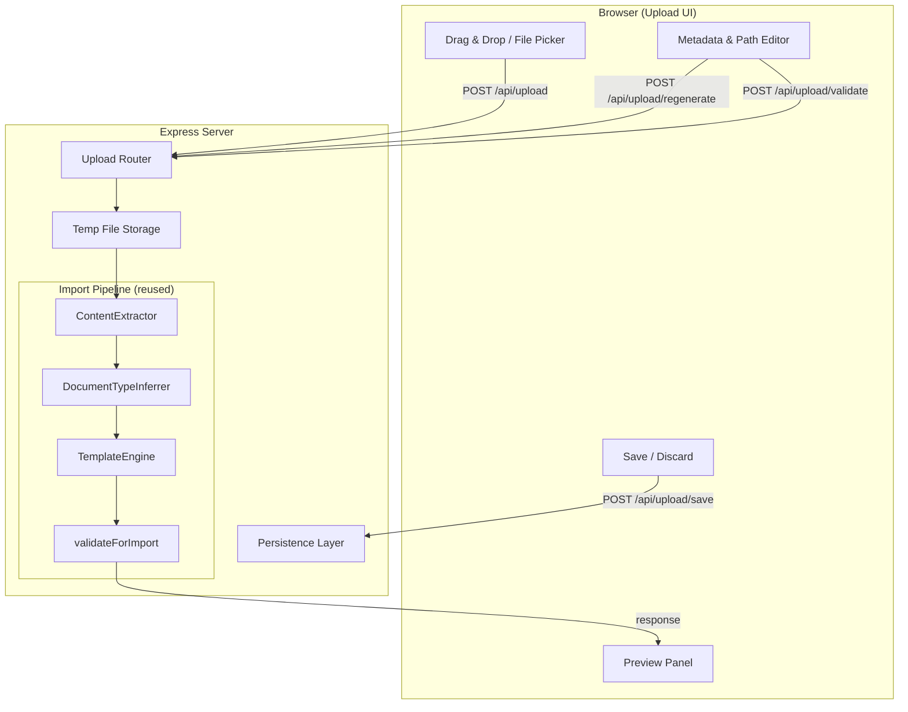
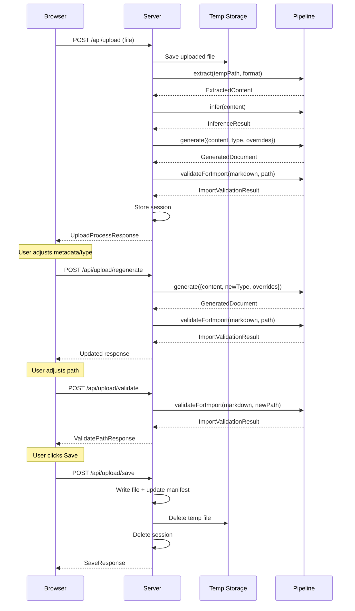

# Design Document: Browser Upload

## Overview

The Browser Upload feature exposes the existing CLI-based document import pipeline through a web interface integrated into the Express dashboard. Users can upload source documents (PDF, text, markdown) via their browser, preview the converted output, adjust the target path/filename and metadata, and save — all without touching the command line.

The architecture keeps all import logic server-side (reusing `ContentExtractor`, `DocumentTypeInferrer`, `TemplateEngine`, `validateForImport`, and manifest update) and introduces a thin HTTP API layer plus a vanilla HTML/JS frontend served by the same Express app at `/upload`.



## Architecture

### High-Level Architecture

The feature adds a new Express Router mounted on the existing dashboard app. The router exposes four endpoints that orchestrate the import pipeline stages. A temporary file storage mechanism holds uploaded files during the session. The browser frontend is a single HTML page (with inline CSS/JS) served by Express — matching the pattern used by the existing dashboard.



### Integration with Existing Dashboard

The upload feature integrates into the existing dashboard (`tools/src/dashboard.ts`) through Express Router composition:

1. A new file `tools/src/upload-router.ts` exports an Express Router with all upload endpoints
2. The dashboard imports and mounts this router: `app.use(uploadRouter)`
3. The dashboard HTML header gains a navigation link to `/upload`
4. The upload page is a separate HTML response served at `GET /upload`

This keeps the existing dashboard code untouched except for adding one import and one `app.use()` call, plus a nav link in the HTML.

### Temp File Management

Uploaded files are written to a `tmp/uploads/` directory relative to the project root. Each upload gets a unique filename (UUID + original extension). Temp files are cleaned up:
- On successful save (file processed and persisted)
- On explicit discard (user clicks Discard)
- On server startup (clears stale temp files from previous sessions)

### Key Design Decisions

| Decision | Rationale |
|----------|-----------|
| Vanilla HTML/JS (no framework) | Matches existing dashboard pattern; no build step needed; keeps tooling simple |
| Server-side pipeline only | All import logic stays in one place; browser never runs extraction/conversion |
| Session-based temp storage (file on disk) | Simple; no database needed; supports large files; UUID prevents collisions |
| Separate router file | Clean separation; easy to test; minimal changes to dashboard.ts |
| `multer` for multipart parsing | Standard Express middleware for file uploads; handles streaming and size limits |

## Components and Interfaces

### UploadRouter (`tools/src/upload-router.ts`)

The Express Router that handles all upload API endpoints and serves the upload UI page.

```typescript
import { Router } from 'express';

export function createUploadRouter(rootDir: string): Router;
```

### API Endpoints

#### `POST /api/upload` — Upload and Process

Accepts a multipart file upload, runs extraction → type inference → template generation → validation, and returns the full result.

**Request:** `multipart/form-data` with field `file`

**Response (200):**
```typescript
interface UploadProcessResponse {
  sessionId: string;               // UUID identifying this upload session
  markdown: string;                // Generated document content
  suggestedPath: string;           // e.g. "pillars/sports/discovery/live-betting"
  suggestedFilename: string;       // e.g. "research.md"
  documentType: DocumentType;      // Inferred type
  confidence: 'high' | 'medium' | 'low';
  availableTypes: DocumentType[];  // All options for override
  frontmatter: FrontmatterFields;  // Parsed frontmatter for editing
  validation: ImportValidationResult;
}
```

**Error Response (400/500):**
```typescript
interface UploadErrorResponse {
  error: string;
  stage?: 'intake' | 'extraction' | 'conversion' | 'validation';
}
```

#### `POST /api/upload/regenerate` — Re-generate with Overrides

Re-runs TemplateEngine with updated document type or metadata overrides.

**Request:**
```typescript
interface RegenerateRequest {
  sessionId: string;
  documentType?: DocumentType;
  overrides?: {
    owner?: string;
    subdomain?: string;
    experienceArea?: string;
  };
}
```

**Response (200):** Same shape as `UploadProcessResponse` (minus `sessionId`)

#### `POST /api/upload/validate` — Re-validate Path

Runs naming/path validation against a user-modified target path and filename.

**Request:**
```typescript
interface ValidatePathRequest {
  sessionId: string;
  targetPath: string;
  filename: string;
}
```

**Response (200):**
```typescript
interface ValidatePathResponse {
  validation: ImportValidationResult;
}
```

#### `POST /api/upload/save` — Persist Document

Writes the generated document to disk and updates the manifest.

**Request:**
```typescript
interface SaveRequest {
  sessionId: string;
  targetPath: string;
  filename: string;
}
```

**Response (200):**
```typescript
interface SaveResponse {
  success: true;
  savedPath: string;
  manifestUpdated: boolean;
}
```

**Error Response (500):**
```typescript
interface SaveErrorResponse {
  success: false;
  error: string;
}
```

#### `DELETE /api/upload/:sessionId` — Discard Session

Cleans up temp files for the session.

**Response (200):** `{ success: true }`

#### `GET /upload` — Serve Upload UI

Returns the HTML page containing the upload interface.

### UploadSession (`tools/src/upload-session.ts`)

Manages server-side state between API calls within a single upload flow.

```typescript
interface UploadSession {
  id: string;                          // UUID
  tempFilePath: string;                // Path to uploaded file in tmp/
  originalFilename: string;            // User's original filename
  format: SupportedFormat;             // Detected format
  extractedContent: ExtractedContent;  // Cached extraction result
  generatedDocument: GeneratedDocument; // Latest generated output
  documentType: DocumentType;          // Current (possibly overridden) type
  confidence: 'high' | 'medium' | 'low';
  overrides: Partial<FrontmatterFields>;
  createdAt: Date;
}

class SessionStore {
  create(data: Omit<UploadSession, 'id' | 'createdAt'>): UploadSession;
  get(id: string): UploadSession | undefined;
  update(id: string, patch: Partial<UploadSession>): void;
  delete(id: string): void;
  cleanup(maxAgeMs?: number): void;  // Remove stale sessions
}
```

### Upload UI (`GET /upload`)

A single-page vanilla HTML/JS application with the following states:

```mermaid
statechart
    [*] --> UploadState
    UploadState --> ProcessingState: file selected
    ProcessingState --> PreviewState: success
    ProcessingState --> ErrorState: failure
    PreviewState --> ProcessingState: regenerate
    PreviewState --> UploadState: discard
    PreviewState --> SavingState: save
    SavingState --> SuccessState: saved
    SavingState --> PreviewState: error
    ErrorState --> UploadState: retry
    SuccessState --> UploadState: upload another
```

**UI Layout (Preview State):**
- Left column: rendered markdown preview with frontmatter displayed as key-value pairs
- Right column: controls panel with:
  - Document type selector (dropdown)
  - Metadata fields (owner, subdomain, experience area)
  - Target path and filename text inputs
  - Validation errors grouped by category
  - Save / Discard buttons

### Reuse of Import Pipeline (No CLI ConfirmationInterface)

The browser workflow replaces the CLI's `ConfirmationInterface` entirely. Instead of the interactive terminal loop, the browser upload:

1. **Does NOT instantiate `ImportService`** — it calls pipeline components directly
2. **ContentExtractor** → called directly with the temp file path
3. **DocumentTypeInferrer** → called directly with extracted content
4. **TemplateEngine** → called directly with extracted content + overrides
5. **validateForImport** → called directly with generated markdown + target path
6. **Persistence** — reimplements the simple write + manifest update logic (same as `ImportService.persist()`)

This avoids any dependency on `ConfirmationInterface` and the interactive loop pattern while reusing all the actual business logic.

## Data Models

### Upload Session Lifecycle



### Client-Side Validation Rules (before upload)

```typescript
const CLIENT_VALIDATION = {
  maxFileSizeBytes: 20 * 1024 * 1024,  // 20 MB
  allowedExtensions: ['.pdf', '.txt', '.text', '.md', '.markdown'],
  maxFileCount: 1,
  minFileSizeBytes: 1,  // Reject 0-byte files
};
```

### Path/Filename Validation (server-side)

```typescript
const PATH_RULES = {
  filenamePattern: /^[a-z0-9]+(-[a-z0-9]+)*\.md$/,
  folderSegmentPattern: /^[a-z0-9]+(-[a-z0-9]+)*$/,
  maxFilenameLength: 64,
  maxSegmentLength: 64,
  maxPathFieldLength: 256,
};
```

### Available Document Types

```typescript
const AVAILABLE_DOCUMENT_TYPES: DocumentType[] = [
  'overview', 'principles', 'patterns', 'research',
  'decisions', 'guidelines', 'examples',
];
```


## Correctness Properties

*A property is a characteristic or behavior that should hold true across all valid executions of a system — essentially, a formal statement about what the system should do. Properties serve as the bridge between human-readable specifications and machine-verifiable correctness guarantees.*

### Property 1: File extension validation correctness

*For any* filename string, the client-side validation SHALL accept it if and only if its extension is in the set `{.pdf, .txt, .text, .md, .markdown}`. Furthermore, for any rejected file, the error message SHALL contain all five supported extensions.

**Validates: Requirements 1.5, 1.6**

### Property 2: Successful processing response completeness

*For any* valid uploaded file (supported format, non-empty, ≤ 20 MB) that processes without extraction errors, the server response SHALL contain all required fields: `markdown` (non-empty string), `suggestedPath` (non-empty string), `suggestedFilename` (non-empty string matching kebab-case `.md` pattern), `confidence` (one of 'high'|'medium'|'low'), and `validation` (object with `frontmatterErrors`, `structureErrors`, `namingErrors` arrays).

**Validates: Requirements 2.5**

### Property 3: Pipeline error response includes stage and reason

*For any* uploaded file that causes a pipeline stage to fail (extraction, conversion, or validation), the error response SHALL include a non-empty `error` string describing the cause AND a `stage` field identifying which pipeline stage failed.

**Validates: Requirements 2.6, 2.7**

### Property 4: Low confidence response includes available types

*For any* uploaded file where the DocumentTypeInferrer returns confidence `'low'`, the processing response SHALL include `confidence: 'low'` AND an `availableTypes` array containing all seven document types (overview, principles, patterns, research, decisions, guidelines, examples).

**Validates: Requirements 2.8**

### Property 5: Frontmatter display completeness

*For any* generated document with N frontmatter fields, the preview rendering SHALL produce output containing each field name and each field value as distinct visible elements — no field SHALL be omitted from the display.

**Validates: Requirements 3.2**

### Property 6: Markdown-to-HTML structure preservation

*For any* markdown body containing headings (levels 1–6), unordered lists, ordered lists, or tables, the HTML rendering SHALL produce corresponding semantic HTML elements (`<h1>`–`<h6>`, `<ul>/<li>`, `<ol>/<li>`, `<table>`) — no structural element SHALL be dropped during conversion.

**Validates: Requirements 3.3**

### Property 7: Kebab-case path validation

*For any* target path string, the server-side validation SHALL report a naming error for each folder segment that does not match the pattern `^[a-z0-9]+(-[a-z0-9]+)*$` (max 64 chars), and SHALL report a naming error for any filename that does not match `^[a-z0-9]+(-[a-z0-9]+)*\.md$` (max 64 chars). The error SHALL identify the specific invalid segment or filename.

**Validates: Requirements 4.3, 4.4, 4.5**

### Property 8: Path traversal rejection

*For any* user-provided target path that resolves to a location outside the repository root directory (via `../` segments, absolute paths, or symlink-like traversals), the server SHALL reject the path with a validation error and SHALL NOT write any file.

**Validates: Requirements 4.6**

### Property 9: Document type override regeneration

*For any* valid extracted content and any document type override from the available set, re-generating with the override SHALL produce a `GeneratedDocument` whose frontmatter `document-type` field equals the overridden type, and whose sections match the template for that type (including research-specific sections when type is 'research').

**Validates: Requirements 5.3, 5.4**

### Property 10: Metadata override regeneration

*For any* valid extracted content and any non-empty metadata override (owner, subdomain, or experience-area), re-generating with the override SHALL produce a `GeneratedDocument` whose frontmatter contains the overridden values exactly as provided — overrides SHALL NOT be modified or normalised.

**Validates: Requirements 6.2, 6.3**

### Property 11: Save persistence round-trip

*For any* valid generated document and valid target path (passes all validation checks), saving SHALL write a file at the specified path whose content equals the generated markdown, AND the manifest SHALL contain an entry whose `path` field matches the saved file's relative path.

**Validates: Requirements 7.3, 7.4**

## Error Handling

### Client-Side Validation Errors (before upload)

| Error Condition | Behaviour |
|----------------|-----------|
| Unsupported file extension | Reject immediately; display error listing `.pdf, .txt, .text, .md, .markdown` |
| File exceeds 20 MB | Reject immediately; display error stating max size is 20 MB |
| File is 0 bytes | Reject immediately; display error that file is empty |
| Multiple files dropped | Reject immediately; display error that only one file at a time is allowed |

### Server-Side Processing Errors

| Error Condition | Behaviour |
|----------------|-----------|
| File not found in temp storage | 404 response: `"Upload session not found or expired"` |
| Extraction fails (unreadable content) | 400 response: `{ error: "...", stage: "extraction" }` |
| TemplateEngine throws | 500 response: `{ error: "...", stage: "conversion" }` |
| Validation unexpectedly throws | 500 response: `{ error: "...", stage: "validation" }` |
| Session ID not found | 404 response: `{ error: "Session not found" }` |

### Path/Filename Validation Errors

| Error Condition | Behaviour |
|----------------|-----------|
| Filename not kebab-case | Return naming error: `"Filename must match kebab-case pattern"` |
| Folder segment not kebab-case | Return naming error: `"Folder segment '{name}' must be kebab-case"` |
| Path resolves outside root | Return naming error: `"Path must be within the repository root"` |
| Empty path or filename | Return naming error: `"Path/filename is required"` |
| Path or filename exceeds 256 chars | Return naming error: `"Maximum length is 256 characters"` |

### Persistence Errors

| Error Condition | Behaviour |
|----------------|-----------|
| Directory creation fails | 500 response: `{ success: false, error: "Cannot create directory: ..." }` |
| File write fails | 500 response: `{ success: false, error: "Failed to write file: ..." }` |
| Manifest update fails | Still return success (file was saved); `manifestUpdated: false` |

### Recovery Strategy

- **Client errors**: User corrects the issue and retries immediately (no state lost)
- **Processing errors**: Upload state resets; user can retry with the same or a different file
- **Persistence errors**: Preview state is preserved; user can retry Save without re-uploading
- **Session expiry**: Old temp files cleaned on server startup; user simply re-uploads
- **No partial writes**: File persistence is atomic — if manifest update fails, the file is still saved (manifest can be regenerated with `npm run manifest`)

## Testing Strategy

### Unit Tests (Vitest)

Unit tests cover individual components with concrete examples:

- **Upload Router**: Test each endpoint with mock request/response objects
  - Valid upload produces correct response shape
  - Invalid file format returns 400 with stage info
  - Regenerate with type override calls TemplateEngine correctly
  - Validate path catches invalid segments
  - Save writes file and updates manifest
  - Delete session cleans up temp file
- **SessionStore**: Test session CRUD and cleanup logic
- **Client-side validation**: Test extension checking, size checking, multi-file rejection
- **Markdown-to-HTML renderer**: Test rendering of headings, lists, tables, frontmatter display

### Property-Based Tests (fast-check + Vitest)

Property-based tests verify universal properties using the `fast-check` library:

- Minimum **100 iterations** per property test
- Each test tagged with: `Feature: browser-upload, Property {N}: {description}`
- Generators produce:
  - Random filenames with random extensions (supported and unsupported)
  - Random file content in supported formats (for processing tests)
  - Random path strings with valid/invalid kebab-case segments
  - Random frontmatter field sets (for rendering completeness)
  - Random markdown content with headings/lists/tables (for HTML conversion)
  - Random metadata overrides (for regeneration correctness)
  - Random document type selections (for type override testing)

**Property tests to implement:**

| # | Property | Key Generators |
|---|----------|---------------|
| 1 | Extension validation | `fc.string()` for filenames + random extensions |
| 2 | Response completeness | Random valid file content by format |
| 3 | Error response format | Random corrupt/unreadable content |
| 4 | Low confidence types list | Content with ambiguous signals |
| 5 | Frontmatter display | Random `FrontmatterFields` objects |
| 6 | HTML structure preservation | Random markdown with structural elements |
| 7 | Kebab-case validation | Random path segments (valid + invalid) |
| 8 | Path traversal rejection | Paths with `../`, absolute prefixes |
| 9 | Type override regeneration | Random content × all 7 document types |
| 10 | Metadata override | Random owner/subdomain/experienceArea strings |
| 11 | Save round-trip | Random valid documents + valid paths |

### Integration Tests

Integration tests verify the full request/response flow:

- Start the Express app, upload a real PDF, verify full response
- Upload markdown, verify extraction → generation → validation pipeline
- Upload, regenerate with type override, verify updated document
- Upload, adjust path, re-validate, save, verify file on disk
- Upload, discard, verify temp file cleaned up
- Verify `/upload` serves HTML page
- Verify dashboard header contains upload navigation link

### Test File Structure

```
tools/tests/
├── upload-router.test.ts              # Integration tests for HTTP endpoints
├── upload-router.property.test.ts     # Property-based tests for router logic
├── upload-session.test.ts             # Unit tests for SessionStore
├── upload-validation.property.test.ts # Property tests for client/server validation
├── upload-ui.test.ts                  # Unit tests for UI rendering logic
└── upload-integration.test.ts         # End-to-end tests with real files
```
