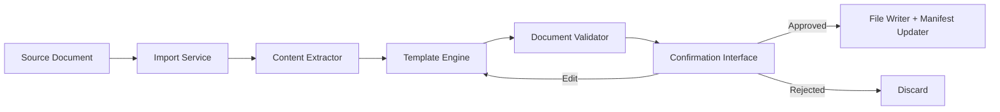
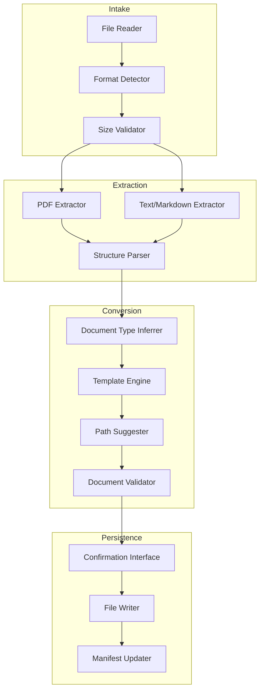

# Design Document: Document Import Workflow

## Overview

The Document Import Workflow provides an automated pipeline for converting uploaded source documents (PDFs, plain text, markdown) into the repository's standardised markdown format. It integrates with the existing tooling ecosystem (`tools/src/`) — reusing the frontmatter schema, structure validator, path generator, naming rules, and manifest generator — to ensure imported documents are indistinguishable from hand-authored ones.

The workflow executes as a CLI command (`npm run import`) implemented in TypeScript, following the same patterns as the existing `validate`, `manifest`, and `scaffold` scripts. It orchestrates four stages: **intake → extraction → conversion → persistence**, with a user confirmation step between conversion and persistence.



## Architecture

### High-Level Architecture

The import workflow follows a pipeline architecture with clearly separated stages. Each stage has a single responsibility and communicates via well-defined data structures.



### Integration with Existing Tooling

The import workflow reuses existing modules rather than reimplementing logic:

| Concern | Existing Module | Usage |
|---------|----------------|-------|
| Frontmatter validation | `frontmatter-validator.ts` | Validate generated frontmatter |
| Structure validation | `structure-validator.ts` | Validate section order, required sections, AI markers |
| Path generation | `path-generator.ts` | Generate target file path from metadata |
| Naming rules | `naming-validator.ts` | Validate kebab-case filenames and folders |
| Manifest update | `manifest-generator.ts` | Add new entry via `updateManifestEntry()` |
| Type definitions | `types.ts` | Reuse `ManifestEntry`, `DocumentType`, `Relationship` etc. |

### New Modules

| Module | Responsibility |
|--------|---------------|
| `tools/src/import-service.ts` | Orchestrates the full import pipeline |
| `tools/src/content-extractor.ts` | Extracts text and structure from source documents |
| `tools/src/template-engine.ts` | Maps extracted content to repository template |
| `tools/src/document-type-inferrer.ts` | Infers document-type from content signals |
| `tools/src/confirmation-interface.ts` | CLI prompts for user review and approval |
| `tools/src/import.ts` | CLI entry point (similar to `scaffold.ts`) |

## Components and Interfaces

### ImportService

The orchestrator that ties all stages together.

```typescript
interface ImportOptions {
  filePath: string;
  owner?: string;           // Override inferred owner
  subdomain?: string;       // Override inferred subdomain
  experienceArea?: string;  // Override inferred experience area
}

interface ImportResult {
  success: boolean;
  savedPath?: string;
  manifestUpdated?: boolean;
  errors?: string[];
}

class ImportService {
  async import(options: ImportOptions): Promise<ImportResult>;
}
```

### ContentExtractor

Handles format-specific text and structure extraction.

```typescript
interface ExtractedContent {
  rawText: string;
  paragraphs: string[];
  headings: HeadingNode[];
  tables: TableData[];
  metadata: InferredMetadata;
}

interface HeadingNode {
  level: number;       // 1-6
  text: string;
  children: HeadingNode[];
}

interface TableData {
  headers: string[];
  rows: string[][];
}

interface InferredMetadata {
  title?: string;
  possibleTags?: string[];
  possibleSubdomain?: string;
  possibleExperienceArea?: string;
}

class ContentExtractor {
  async extract(filePath: string, format: SupportedFormat): Promise<ExtractedContent>;
}
```

### TemplateEngine

Maps extracted content to the repository markdown template.

```typescript
interface TemplateOptions {
  extractedContent: ExtractedContent;
  documentType: DocumentType;
  overrides?: Partial<FrontmatterFields>;
}

interface GeneratedDocument {
  markdown: string;
  frontmatter: FrontmatterFields;
  sections: SectionContent[];
  suggestedPath: string;
  suggestedFilename: string;
}

interface SectionContent {
  name: string;
  content: string;
  isPlaceholder: boolean;
}

interface FrontmatterFields {
  title: string;
  subdomain: string;
  'experience-area': string;
  'document-type': DocumentType;
  owner: string;
  'last-updated': string;
  status: 'draft';
  tags: string[];
  summary: string;
}

class TemplateEngine {
  generate(options: TemplateOptions): GeneratedDocument;
}
```

### DocumentTypeInferrer

Determines the document type from content signals.

```typescript
interface InferenceResult {
  documentType: DocumentType;
  confidence: 'high' | 'medium' | 'low';
  signals: string[];   // reasons for the inference
}

class DocumentTypeInferrer {
  infer(content: ExtractedContent): InferenceResult;
}
```

### ConfirmationInterface

CLI-based user review and approval flow.

```typescript
interface ConfirmationPrompt {
  suggestedPath: string;
  suggestedFilename: string;
  markdown: string;
  validationErrors: string[];
  pathExists: boolean;
  fileExists: boolean;
}

type ConfirmationResponse =
  | { action: 'approve' }
  | { action: 'reject' }
  | { action: 'changePath'; newPath: string; newFilename: string }
  | { action: 'editContent'; instructions: string };

class ConfirmationInterface {
  async prompt(data: ConfirmationPrompt): Promise<ConfirmationResponse>;
}
```

### DocumentValidator (Import-specific wrapper)

Wraps existing validators for import-time validation.

```typescript
interface ImportValidationResult {
  valid: boolean;
  frontmatterErrors: string[];
  structureErrors: string[];
  namingErrors: string[];
}

function validateForImport(markdown: string, targetPath: string): ImportValidationResult;
```

## Data Models

### Supported Formats

```typescript
type SupportedFormat = 'pdf' | 'txt' | 'md';

const FORMAT_EXTENSIONS: Record<SupportedFormat, string[]> = {
  pdf: ['.pdf'],
  txt: ['.txt', '.text'],
  md: ['.md', '.markdown'],
};

const MAX_FILE_SIZE_BYTES = 20 * 1024 * 1024; // 20 MB
```

### Template Section Mapping

The template engine maps extracted content to these canonical sections (matching the existing `SECTION_ORDER` in `structure-validator.ts`):

```typescript
const TEMPLATE_SECTIONS = [
  'overview',
  'principles-in-context',
  'current-state',
  'guidelines',
  'component-map',
  'examples',
  'research-references',
  'decision-log',
  'related-areas',
] as const;

const RESEARCH_EXTRA_SECTIONS = [
  'methodology',
  'findings',
  'recommendations',
] as const;

const PLACEHOLDER_TEXT = 'TODO: Add content for this section.';
```

### Document Type Inference Signals

```typescript
const TYPE_SIGNALS: Record<DocumentType, string[]> = {
  research: ['methodology', 'findings', 'participants', 'sample size', 'usability study'],
  patterns: ['pattern', 'when to use', 'anatomy', 'variants', 'do/don\'t'],
  guidelines: ['guidelines', 'must', 'should', 'recommended', 'do not'],
  overview: ['overview', 'introduction', 'scope', 'context'],
  principles: ['principle', 'rationale', 'evaluation', 'anti-pattern'],
  decisions: ['decision', 'alternatives', 'rationale', 'trade-off'],
  examples: ['example', 'demonstration', 'sample', 'showcase'],
};
```

### Pipeline State

```typescript
interface PipelineState {
  stage: 'intake' | 'extraction' | 'conversion' | 'validation' | 'confirmation' | 'persistence';
  sourceFile: string;
  format: SupportedFormat;
  extractedContent?: ExtractedContent;
  generatedDocument?: GeneratedDocument;
  validationResult?: ImportValidationResult;
  userResponse?: ConfirmationResponse;
  savedPath?: string;
}
```

## Correctness Properties

*A property is a characteristic or behavior that should hold true across all valid executions of a system — essentially, a formal statement about what the system should do. Properties serve as the bridge between human-readable specifications and machine-verifiable correctness guarantees.*

### Property 1: Unsupported format rejection

*For any* file with an extension not in the supported set (`.pdf`, `.txt`, `.text`, `.md`, `.markdown`), the Import Service SHALL reject the file and the error message SHALL list all supported formats.

**Validates: Requirements 1.6**

### Property 2: Paragraph boundary preservation

*For any* source text containing paragraph breaks (double newlines or structural markers), the Content Extractor SHALL produce a `paragraphs` array where each element corresponds to one source paragraph and no paragraph text is lost or merged.

**Validates: Requirements 2.1**

### Property 3: Heading hierarchy preservation

*For any* source document containing headings at various levels, the Content Extractor SHALL produce a `HeadingNode` tree where the parent-child nesting matches the original heading hierarchy.

**Validates: Requirements 2.2**

### Property 4: Table structure preservation

*For any* source document containing a table with R rows and C columns, the Content Extractor SHALL produce a `TableData` object with exactly R rows and C columns, and cell content SHALL match the source.

**Validates: Requirements 2.3**

### Property 5: Template conformance with complete sections

*For any* extracted content (regardless of coverage), the Template Engine SHALL produce a markdown document that contains ALL sections defined in `TEMPLATE_SECTIONS`, in the correct canonical order, with non-empty content (either mapped source content or placeholder text).

**Validates: Requirements 3.1, 3.4**

### Property 6: Frontmatter completeness invariant

*For any* generated Target Document, the frontmatter block SHALL contain all required fields as defined in `frontmatter.schema.json`, the `status` field SHALL equal `"draft"`, and the `last-updated` field SHALL be today's date in `YYYY-MM-DD` format.

**Validates: Requirements 3.2, 3.5, 3.6**

### Property 7: Content-to-section mapping correctness

*For any* extracted content where headings can be matched to template section names, the Template Engine SHALL place that content under the corresponding template section rather than in a mismatched section or the placeholder.

**Validates: Requirements 3.3**

### Property 8: Path generation from metadata

*For any* valid subdomain and experience-area pair, the Import Service SHALL suggest a target path matching the pattern `pillars/sports/{subdomain}/{experience-area}/{document-type}.md` (or the equivalent hierarchy for the inferred pillar).

**Validates: Requirements 4.1**

### Property 9: Kebab-case filename derivation

*For any* document title string, the suggested filename SHALL be a valid kebab-case string (matching pattern `^[a-z0-9]+(-[a-z0-9]+)*\.md$`) and SHALL be derived from the title by lowercasing, replacing spaces and special characters with hyphens, and removing invalid characters.

**Validates: Requirements 4.2**

### Property 10: Validation detects all violations

*For any* generated document that is missing required frontmatter fields OR missing required template sections, the Document Validator SHALL return a non-empty error list where each error specifically identifies the missing field or section.

**Validates: Requirements 6.1, 6.2, 6.3**

### Property 11: Manifest round-trip completeness

*For any* saved Target Document, the manifest SHALL contain an entry where `path`, `title`, `subdomain`, `experienceArea`, `documentType`, `owner`, `lastUpdated`, `status`, `tags`, and `summary` all match the saved document's frontmatter values.

**Validates: Requirements 7.1, 7.2**

### Property 12: Relationship propagation to manifest

*For any* saved Target Document that defines relationships in its frontmatter, the manifest `relationships` array SHALL contain corresponding entries with correct `source`, `target`, and `type` values.

**Validates: Requirements 7.3**

### Property 13: Document-type inference correctness

*For any* source content containing strong document-type signals (e.g., "methodology" + "findings" for research), the Document Type Inferrer SHALL return the matching document type with confidence "high".

**Validates: Requirements 8.1**

### Property 14: Research template variant includes required sections

*For any* document where the inferred or selected document-type is "research", the generated markdown SHALL include the additional sections: methodology, findings, and recommendations.

**Validates: Requirements 8.2**

## Error Handling

### File Intake Errors

| Error Condition | Behaviour |
|----------------|-----------|
| File not found | Return error: `"File not found: {path}"` |
| File exceeds 20 MB | Return error: `"File exceeds maximum size of 20 MB ({actualSize} MB)"` |
| Unsupported format | Return error: `"Unsupported format '{ext}'. Supported: .pdf, .txt, .md"` |
| File read permission denied | Return error: `"Cannot read file: permission denied"` |

### Extraction Errors

| Error Condition | Behaviour |
|----------------|-----------|
| No extractable text | Return error: `"Text extraction failed: no readable content found"` |
| PDF parsing failure | Return error: `"Failed to parse PDF: {underlying error}"` |
| Encoding issues | Attempt UTF-8 decoding; fallback to Latin-1; return error if both fail |

### Conversion Errors

| Error Condition | Behaviour |
|----------------|-----------|
| Document-type inference fails (low confidence) | Prompt user to select type via Confirmation Interface |
| Template generation failure | Return error with details; do not proceed to validation |

### Validation Errors

| Error Condition | Behaviour |
|----------------|-----------|
| Frontmatter validation fails | Present specific field errors; block save |
| Structure validation fails | Present section errors; block save |
| Naming validation fails | Present naming rule violations; block save |

### Persistence Errors

| Error Condition | Behaviour |
|----------------|-----------|
| Target directory creation fails | Return error: `"Cannot create directory: {path}"` |
| File write fails | Return error: `"Failed to write file: {reason}"` |
| Manifest update fails | Return error; file is still saved (manifest can be regenerated via `npm run manifest`) |

### Recovery Strategy

All errors are non-destructive — the workflow never partially writes or corrupts existing files. If any step fails after the confirmation stage, the system rolls back by not committing changes. The user can retry with corrected input or override options.

## Testing Strategy

### Unit Tests (Vitest)

Unit tests cover individual module logic with concrete examples:

- **ContentExtractor**: Test each format (PDF mock, text, markdown) with known inputs/outputs
- **TemplateEngine**: Test section mapping, placeholder insertion, frontmatter generation
- **DocumentTypeInferrer**: Test inference with clear signals and ambiguous content
- **Path/filename suggestion**: Test kebab-case transformation, subdomain-based paths
- **Validation wrapper**: Test that existing validators are correctly composed

### Property-Based Tests (fast-check + Vitest)

Property-based tests verify universal properties using the `fast-check` library (already in devDependencies):

- Minimum **100 iterations** per property test
- Each test tagged with: `Feature: document-import-workflow, Property {N}: {description}`
- Generators produce:
  - Random file extensions (supported and unsupported)
  - Random text with paragraph breaks and heading hierarchies
  - Random table structures (varying rows/columns)
  - Random frontmatter field subsets (for validation testing)
  - Random document titles (for kebab-case transformation)
  - Random metadata combinations (subdomain × experience-area × document-type)

### Integration Tests

Integration tests verify the full pipeline end-to-end:

- Upload a real PDF and verify the output file structure
- Upload markdown and verify round-trip fidelity
- Verify manifest.json is correctly updated after save
- Verify overwrite warning when target file exists
- Verify directory creation when target path is new

### Test File Structure

```
tools/tests/
├── import-service.test.ts          # Integration tests
├── content-extractor.test.ts       # Unit + property tests
├── template-engine.test.ts         # Unit + property tests
├── document-type-inferrer.test.ts  # Unit + property tests
├── confirmation-interface.test.ts  # Unit tests (mocked stdin)
└── import-validation.test.ts       # Property tests for validation
```
