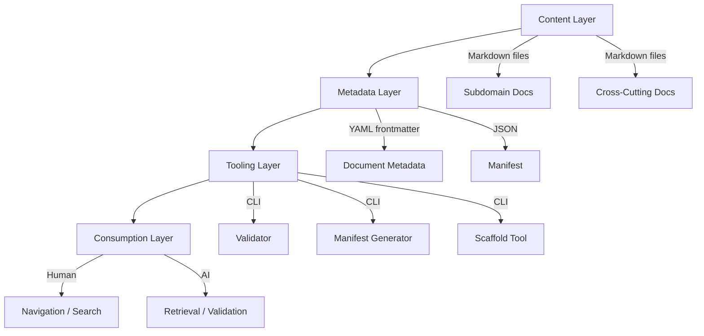

# Design Document: Sports Experience Guidelines

## Overview

The Sports Experience Guidelines framework is a knowledge architecture system that organises, validates, and serves experience design documentation for a sports betting organisation. It is not a runtime application but a structured documentation framework with tooling for validation, manifest generation, and AI-consumable retrieval.

The system operates as a file-based knowledge repository with:
- A hierarchical folder structure governed by strict naming conventions
- YAML frontmatter metadata on every document for machine-readability
- Validation tooling that enforces structural and content rules
- A manifest system for navigation, search, and dependency resolution
- An ownership model mapped to Pod-based teams
- AI-specific annotations and chunking for agent consumption

The primary consumers are Product Designers, UX Researchers, Product Managers, Engineers, Content Designers, and AI agents. The framework must scale to 500+ documents while maintaining sub-2-second search and sub-3-second navigation rendering.

### Design Decisions

1. **File-based over database-backed**: The framework uses Markdown files in a Git repository rather than a CMS or database. This enables version control, PR-based review workflows, and offline access while remaining AI-parseable.
2. **YAML frontmatter for metadata**: Every document carries structured metadata in YAML frontmatter, enabling both human readability and machine parsing without separate metadata stores.
3. **Node.js tooling**: Validation, manifest generation, and search indexing are implemented as Node.js CLI tools, aligning with the front-end-heavy engineering culture and enabling integration with CI/CD pipelines.
4. **Static manifest over runtime indexing**: A pre-generated manifest JSON file serves as the search/navigation index, avoiding runtime dependencies and enabling both human and AI consumption from a single source of truth.

## Architecture

The system comprises four layers:



### Layer Descriptions

1. **Content Layer**: Markdown documents organised in a hierarchical folder structure. Each document follows the Documentation Template and contains inline AI annotations.

2. **Metadata Layer**: YAML frontmatter on each document plus a root-level `manifest.json` that indexes all documents with their metadata, paths, and relationships.

3. **Tooling Layer**: Node.js CLI tools that validate documents against schema rules, generate/update the manifest, scaffold new documents from templates, and check cross-reference integrity.

4. **Consumption Layer**: Interfaces for humans (rendered Markdown navigation, search via manifest) and AI agents (structured retrieval with dependency chain resolution, constraint annotations).

### Folder Structure

```
sports-experience-guidelines/
├── manifest.json                          # Auto-generated index of all documents
├── index.md                               # Root navigation document
├── principles/
│   └── overview.md                        # UX Principles document
├── discovery/
│   ├── index.md                           # Subdomain overview
│   ├── {experience-area}/
│   │   ├── overview.md
│   │   ├── principles.md
│   │   ├── patterns.md
│   │   ├── research.md
│   │   ├── decisions.md
│   │   ├── guidelines.md
│   │   └── examples.md
├── transactional/
│   ├── index.md
│   ├── {experience-area}/
│   │   └── ...
├── post-bet/
│   ├── index.md
│   ├── {experience-area}/
│   │   └── ...
├── cross-cutting-areas/
│   ├── index.md
│   ├── live-betting/
│   │   └── {document-type}.md
│   ├── horse-racing/
│   ├── bet-builder/
│   ├── personalisation/
│   ├── streaming-and-visualisations/
│   ├── promotions-and-boosts/
│   ├── responsible-gambling/
│   ├── localisation/
│   ├── accessibility/
│   └── design-system/
├── ownership/
│   ├── raci-matrix.yaml                   # RACI assignments per experience area
│   └── pods.yaml                          # Pod definitions and membership
├── roadmap/
│   └── overview.md                        # Phased implementation plan
└── tools/
    ├── validate.js                        # Document validation CLI
    ├── manifest.js                        # Manifest generation CLI
    ├── scaffold.js                        # Document scaffolding CLI
    └── schemas/
        ├── frontmatter.schema.json        # JSON Schema for frontmatter
        ├── document-types.json            # Enumerated document types
        └── naming-rules.json             # Naming convention rules
```

## Components and Interfaces

### Component 1: Document Validator (`tools/validate.js`)

**Purpose**: Validates all documents against structural, naming, and content rules.

**Interface**:
```
validate [--path <path>] [--fix] [--report <format>]
```

**Responsibilities**:
- Validate folder/file naming conventions (lowercase-kebab-case, max 64 chars)
- Validate frontmatter against JSON Schema (required fields, value formats, enumerated values)
- Validate document structure against Documentation Template (section order, required sections)
- Validate content constraints (word counts, character limits)
- Validate cross-references (no broken links, no orphaned documents)
- Validate document-type path segments against enumerated list
- Produce structured error reports with document path, error category, and specific field

**Output**: Validation report as JSON or human-readable format:
```typescript
interface ValidationReport {
  valid: boolean;
  errors: ValidationError[];
  warnings: ValidationWarning[];
  summary: {
    documentsChecked: number;
    documentsValid: number;
    documentsFailed: number;
  };
}

interface ValidationError {
  path: string;
  category: 'naming' | 'frontmatter' | 'structure' | 'content' | 'reference';
  field: string;
  rule: string;
  message: string;
}
```

### Component 2: Manifest Generator (`tools/manifest.js`)

**Purpose**: Generates and updates the root-level `manifest.json` from all document frontmatter.

**Interface**:
```
manifest [--output <path>] [--validate]
```

**Responsibilities**:
- Traverse folder structure and collect all Document Nodes
- Extract frontmatter metadata from each document
- Build relationship graph from typed references
- Generate manifest with paths, metadata, and relationships
- Update root `index.md` with navigation links and descriptions

**Output**: `manifest.json` structure:
```typescript
interface Manifest {
  version: string;
  generatedAt: string; // ISO 8601
  documentCount: number;
  documents: ManifestEntry[];
  relationships: Relationship[];
}

interface ManifestEntry {
  path: string;
  title: string;
  subdomain: string;
  experienceArea: string;
  documentType: DocumentType;
  owner: string;
  lastUpdated: string; // ISO 8601
  status: 'draft' | 'in-review' | 'published' | 'deprecated';
  tags: string[];
  summary: string;
  maturity: 'not-started' | 'in-progress' | 'documented' | 'validated';
  wordCount: number;
}

interface Relationship {
  source: string; // document path
  target: string; // document path
  type: 'depends-on' | 'extends' | 'conflicts-with' | 'supersedes' | 'related-to';
}
```

### Component 3: Document Scaffold (`tools/scaffold.js`)

**Purpose**: Generates new documents from the Documentation Template with pre-populated placeholder content.

**Interface**:
```
scaffold --subdomain <name> --area <name> --type <document-type> [--owner <pod>]
```

**Responsibilities**:
- Validate inputs against naming conventions and enumerated types
- Generate deterministic file path from inputs
- Create document with all required sections and placeholder text
- Insert AI annotation markers at defined positions
- Add initial frontmatter with status "draft"
- Update manifest after creation

### Component 4: Search Index

**Purpose**: Enables fast search across all documents via the manifest.

**Interface** (programmatic):
```typescript
interface SearchOptions {
  query: string;
  filters?: {
    subdomain?: string[];
    status?: string[];
    owner?: string[];
    crossCuttingArea?: string[];
    maturity?: string[];
  };
}

interface SearchResult {
  path: string;
  title: string;
  score: number;
  matchedFields: string[];
  metadata: ManifestEntry;
}

function search(manifest: Manifest, options: SearchOptions): SearchResult[];
```

**Search behaviour**:
- Exact tag match (case-insensitive)
- Substring match within title and summary fields
- Filter by subdomain, status, owner, cross-cutting area, maturity
- Multiple filter values combined with OR within a field, AND across fields

### Component 5: AI Retrieval Service

**Purpose**: Provides structured document retrieval with dependency chain resolution for AI agents.

**Interface**:
```typescript
interface RetrievalRequest {
  documentPath: string;
  includeDepth?: number; // max 2
  maxDocuments?: number; // max 20
}

interface RetrievalResponse {
  document: DocumentContent;
  relatedDocuments: DocumentContent[];
  metadataComplete: boolean;
  missingFields?: string[];
  circularReferenceDetected?: boolean;
}

interface DocumentContent {
  path: string;
  frontmatter: Record<string, unknown>;
  chunks: DocumentChunk[];
  constraints: Constraint[];
  relationships: Relationship[];
}

interface DocumentChunk {
  section: string;
  content: string;
  wordCount: number; // max 500
}

interface Constraint {
  type: 'prohibited' | 'required' | 'boundary';
  description: string;
  scope: string;
}
```

### Component 6: Ownership Manager

**Purpose**: Manages RACI assignments, Pod mappings, and ownership lifecycle.

**Data structure** (`ownership/raci-matrix.yaml`):
```yaml
experience-areas:
  - area: "live-betting"
    subdomain: "cross-cutting-areas"
    raci:
      responsible: "pod-live-experience"
      accountable: "pod-live-experience"
      consulted: ["pod-discovery", "pod-transactional"]
      informed: ["pod-design-system"]
    review-cadence: "quarterly"
    last-reviewed: "2025-01-15"
```

## Data Models

### Frontmatter Schema

```yaml
# Required fields
title: string                    # max 100 characters
subdomain: enum                  # discovery | transactional | post-bet | cross-cutting-areas
experience-area: string          # lowercase-kebab-case
document-type: enum              # overview | principles | patterns | research | decisions | guidelines | examples
owner: string                    # Pod name, lowercase-kebab-case
last-updated: date               # ISO 8601 (YYYY-MM-DD)
status: enum                     # draft | in-review | published | deprecated
tags: string[]                   # 1-15 items, each lowercase-kebab-case
summary: string                  # max 200 words, machine-readable summary

# Optional fields
scope-references:                # For cross-cutting documents
  - subdomain: string
    influence: enum              # primary | secondary | informational
relationships:
  depends-on: string[]           # document paths
  extends: string[]
  conflicts-with: string[]
  supersedes: string[]
  related-to: string[]
maturity: enum                   # not-started | in-progress | documented | validated
changelog:
  - date: date
    author: string
    summary: string              # max 150 words
```

### Document Types Enumeration

| Type | Purpose | Typical Content |
|------|---------|-----------------|
| `overview` | High-level introduction to an experience area | Context, scope, key concepts |
| `principles` | Design principles specific to the area | Principles, rationale, examples |
| `patterns` | Reusable interaction/design patterns | Pattern descriptions, usage guidance |
| `research` | Research findings and insights | Findings, methodology, implications |
| `decisions` | Design decisions and their rationale | Decision records, alternatives considered |
| `guidelines` | Specific do/don't guidance | Rules, constraints, recommendations |
| `examples` | Concrete examples and case studies | Screenshots, flows, annotated designs |

### Naming Convention Rules

| Rule | Pattern | Example |
|------|---------|---------|
| Folder names | `[a-z0-9]+(-[a-z0-9]+)*` | `live-betting`, `post-bet` |
| File names | `[a-z0-9]+(-[a-z0-9]+)*.md` | `overview.md`, `bet-builder.md` |
| Max length | 64 characters | — |
| Path segments | lowercase-kebab-case only | `discovery/pre-match/overview.md` |

### UX Principles Data Model

```typescript
interface UXPrinciple {
  id: number;                    // priority order (1 = highest)
  title: string;                 // max 60 characters
  summary: string;               // exactly 1 sentence, max 150 characters
  rationale: string;             // 50-200 words
  evaluationQuestion: string;    // yes/no question
  positiveExamples: Example[];   // exactly 2
  antiPatterns: Example[];       // exactly 2
  rankJustification: string;     // 1 sentence relative to adjacent
  subdomainExceptions: SubdomainException[];
}

interface Example {
  scenario: string;              // max 100 words
}

interface SubdomainException {
  subdomain: 'discovery' | 'transactional' | 'post-bet';
  exception: string;
  rationale: string;
}
```

### Experience Area Inventory Entry

```typescript
interface ExperienceAreaEntry {
  name: string;
  subdomain: string;
  description: string;           // max 150 words
  scopeBoundary: {
    included: string[];
    excluded: string[];
  };
  relatedCrossCuttingAreas: string[];
  maturity: 'not-started' | 'in-progress' | 'documented' | 'validated';
  owner: string;                 // Pod name
  crossReferences?: string[];    // paths to canonical entries if cross-subdomain
}
```

### Cross-Cutting Area Model

```typescript
interface CrossCuttingArea {
  name: string;
  description: string;
  scopeStatement: string;
  influencedSubdomains: ScopeMapEntry[];
  interactionPoints: InteractionPoint[];
}

interface ScopeMapEntry {
  subdomain: string;
  influence: 'primary' | 'secondary' | 'informational';
}

interface InteractionPoint {
  areas: string[];               // 2+ cross-cutting area names
  subdomain: string;
  description: string;
}
```

### Roadmap Phase Model

```typescript
interface RoadmapPhase {
  id: number;
  name: 'foundation' | 'populate' | 'standards' | 'ai-review' | 'ai-generation';
  objectives: string[];
  deliverables: Deliverable[];
  successCriteria: string[];
  durationWeeks: number;
  dependencies: number[];        // phase IDs
  requiredRoles: string[];
  gateCriteria: string[];        // min 2
  quickWins?: QuickWin[];        // Foundation phase only, min 3
}

interface Deliverable {
  name: string;
  description: string;
  dependsOn: string[];           // deliverable names from prior phases
}

interface QuickWin {
  name: string;
  description: string;
  role: string;                  // single role
  maxDurationDays: number;       // max 10 (2 weeks)
}
```

## Correctness Properties

*A property is a characteristic or behavior that should hold true across all valid executions of a system — essentially, a formal statement about what the system should do. Properties serve as the bridge between human-readable specifications and machine-verifiable correctness guarantees.*

### Property 1: Naming Convention Validation

*For any* string input, the naming validator SHALL accept it if and only if it matches the pattern `[a-z0-9]+(-[a-z0-9]+)*`, is at most 64 characters long, and (for files) ends with `.md`; all other inputs SHALL be rejected with a specific rule violation message.

**Validates: Requirements 1.2, 2.1**

### Property 2: Deterministic Path Generation

*For any* valid combination of subdomain (or "cross-cutting-areas"), experience area, and document type, the path generator SHALL always produce the same output path, and that path SHALL match the pattern `{subdomain}/{experience-area}/{document-type}.md` for subdomain documents or `cross-cutting-areas/{experience-area}/{document-type}.md` for cross-cutting documents.

**Validates: Requirements 1.5, 2.1**

### Property 3: Frontmatter Schema Validation

*For any* YAML frontmatter object, the validator SHALL report it as valid if and only if all required fields (title, subdomain, experience-area, document-type, owner, last-updated, status, tags, summary) are present with correct types and values within their defined constraints (status from enumerated list, tags array of 1-15 kebab-case strings, summary ≤200 words, last-updated in ISO 8601 format); otherwise it SHALL report each specific missing or invalid field.

**Validates: Requirements 2.3, 2.6, 8.2**

### Property 4: Document Type Enumeration

*For any* string used as a document-type path segment, the validator SHALL accept it if and only if it is one of: overview, principles, patterns, research, decisions, guidelines, examples; all other values SHALL be rejected with the invalid type identified.

**Validates: Requirements 2.2, 2.7**

### Property 5: Search Correctness

*For any* manifest and search query, the search function SHALL return exactly those documents where the query matches a tag exactly (case-insensitive) OR appears as a substring in the title or summary fields; no matching document SHALL be omitted and no non-matching document SHALL be included. When filters are applied, results SHALL satisfy all active filters (OR within a filter field, AND across filter fields).

**Validates: Requirements 2.4, 4.6, 8.1**

### Property 6: Manifest Completeness

*For any* set of documents in the folder structure, the generated manifest SHALL contain exactly one entry per document with correct path, all frontmatter metadata fields, and all declared relationship references; no document SHALL be missing and no phantom entry SHALL exist.

**Validates: Requirements 2.5, 9.2**

### Property 7: Cross-Reference Integrity

*For any* document graph, the validator SHALL detect and report all broken references (targets that don't exist), orphaned documents (no inbound references and not designated as root-level entry points), and circular references; each error SHALL include the affected document path, error category, and specific reference that failed.

**Validates: Requirements 9.4, 9.5**

### Property 8: Experience Area Entry Validation

*For any* experience area entry, the validator SHALL enforce: description ≤150 words, scope boundary with included and excluded lists both non-empty, related cross-cutting areas list present, maturity value from the enumerated set (not-started, in-progress, documented, validated), and owner Pod assigned.

**Validates: Requirements 4.1, 4.2, 4.3, 5.1**

### Property 9: RACI Matrix Constraints

*For any* RACI assignment for an experience area, the validator SHALL enforce: exactly one Pod in the Accountable role, all role values referencing Pod names (not individual names), and at least one Pod in the Responsible role; areas with no Responsible Pod SHALL be flagged as unowned.

**Validates: Requirements 6.1, 6.2, 6.6**

### Property 10: Template Structure Validation

*For any* document, the validator SHALL verify: sections appear in the defined order (frontmatter, overview, principles-in-context, current-state, guidelines, examples, research-references, decision-log, related-areas), all required sections are present, the combined word count of overview + principles-in-context + current-state + guidelines + related-areas does not exceed 3000 words, and all five AI annotation markers are present at their defined positions.

**Validates: Requirements 7.1, 7.2, 7.3, 7.5**

### Property 11: Document Chunking

*For any* document processed for AI consumption, the chunking function SHALL produce chunks that each contain at most 500 words, respect section boundaries (no chunk spans two sections), and together cover the complete document content without loss or duplication.

**Validates: Requirements 8.3**

### Property 12: Dependency Chain Retrieval

*For any* document retrieval request with depth ≤2, the retrieval function SHALL return the requested document plus all transitively related documents up to the specified depth, return at most 20 documents total, and terminate traversal upon detecting a circular reference without entering an infinite loop.

**Validates: Requirements 8.5**

### Property 13: Incremental Update Isolation

*For any* modification to a single document, the system SHALL not require changes to any document that does not declare a direct dependency on the modified document; adding a new subdomain or cross-cutting area SHALL not modify any existing document path, frontmatter, or cross-reference.

**Validates: Requirements 9.3, 9.6**

### Property 14: Status Transition Guards

*For any* document with one or more validation errors against required-field rules, the system SHALL prevent the document from being assigned status "validated"; and when a document with incomplete metadata is retrieved, the response SHALL include a metadata-incomplete flag with the list of missing/invalid fields.

**Validates: Requirements 7.7, 8.8**

## Error Handling

### Validation Errors

| Error Category | Trigger | Response |
|---|---|---|
| Naming violation | File/folder name doesn't match kebab-case or exceeds 64 chars | Reject creation, report specific rule violated |
| Missing frontmatter field | Required field absent from YAML frontmatter | Flag as invalid, list missing fields, prevent "validated" status |
| Invalid enum value | Status, document-type, maturity, or influence not in allowed set | Reject with specific invalid value and allowed values |
| Word count exceeded | Content body >3000 words or summary >200 words or chunk >500 words | Report section and current count vs limit |
| Broken reference | Relationship target path doesn't exist | Report source path, target path, relationship type |
| Circular reference | Dependency chain forms a cycle | Terminate traversal, flag cycle, return partial results |
| Orphaned document | No inbound references and not a root entry point | Report in validation, suggest adding references or marking as entry point |
| Duplicate accountable | More than one Pod assigned Accountable for an area | Reject RACI update, report conflicting assignments |
| Unowned area | No Responsible Pod assigned | Flag immediately, escalate within 2 business days |

### Error Report Format

All validation errors follow a consistent structure:

```typescript
interface ErrorReport {
  timestamp: string;
  totalErrors: number;
  totalWarnings: number;
  errors: Array<{
    path: string;
    category: string;
    field: string;
    rule: string;
    message: string;
    severity: 'error' | 'warning';
  }>;
}
```

### Graceful Degradation

- If manifest generation encounters an invalid document, it logs the error and continues processing remaining documents, producing a partial manifest with an `incomplete: true` flag
- If AI retrieval encounters a circular reference, it terminates that branch and returns documents collected so far with a `circularReferenceDetected: true` flag
- If search encounters a document with missing metadata, it includes the document in results with reduced match scoring and a metadata warning

## Testing Strategy

### Unit Tests (Example-Based)

Unit tests cover specific scenarios, edge cases, and integration points:

- **Naming validator**: Known valid names ("live-betting", "overview.md"), known invalid names ("LiveBetting", "a".repeat(65), "has spaces")
- **Path generator**: Specific input combinations produce expected paths
- **Frontmatter parser**: Well-formed YAML, malformed YAML, edge cases (empty tags array, boundary word counts)
- **Scaffold tool**: Generates correct skeleton for each document type
- **RACI validator**: Specific valid/invalid matrix configurations
- **Roadmap validator**: Phase ordering, gate criteria counts, quick win constraints
- **Smoke tests**: 10 cross-cutting areas exist, 3 subdomains exist, 5 roadmap phases exist

### Property-Based Tests

Property-based tests verify universal properties across generated inputs. Each test runs a minimum of 100 iterations.

**Library**: [fast-check](https://github.com/dubzzz/fast-check) (TypeScript/JavaScript)

**Configuration**:
- Minimum 100 iterations per property
- Each test tagged with: `Feature: sports-experience-guidelines, Property {N}: {title}`

**Properties to implement**:

| Property | Generator Strategy |
|----------|-------------------|
| 1: Naming Convention | Generate random strings (ASCII, unicode, varying lengths, with/without hyphens, mixed case) |
| 2: Path Generation | Generate random valid (subdomain, area, type) tuples from constrained alphabets |
| 3: Frontmatter Validation | Generate random objects with varying field presence, types, and values |
| 4: Document Type Enum | Generate random strings including valid types and arbitrary strings |
| 5: Search Correctness | Generate random manifests (5-50 docs) and random query strings |
| 6: Manifest Completeness | Generate random folder structures with 1-100 documents |
| 7: Cross-Reference Integrity | Generate random document graphs with deliberate broken links and cycles |
| 8: Experience Area Validation | Generate random entry objects with varying field values and lengths |
| 9: RACI Constraints | Generate random RACI matrices with varying Pod assignments |
| 10: Template Structure | Generate random section orderings and content with varying word counts |
| 11: Chunking | Generate random documents with varying section lengths (0-2000 words per section) |
| 12: Dependency Chain | Generate random DAGs and cyclic graphs with 1-30 nodes |
| 13: Update Isolation | Generate random dependency graphs, apply single-node modifications |
| 14: Status Transition | Generate random documents with varying validation states |

### Integration Tests

- **500-document scale test**: Generate 500+ documents, verify search <2s and navigation <3s
- **End-to-end scaffold → validate → manifest**: Create document, validate it, regenerate manifest, verify consistency
- **CI pipeline integration**: Validate all documents on every PR, block merge on validation failure

