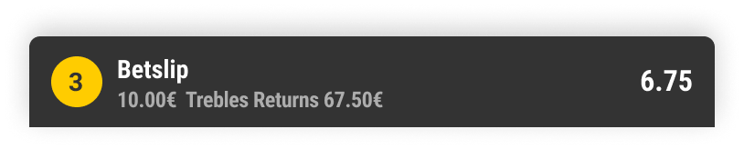

## Overview

The Bet Bar is the persistent bottom-of-screen component that serves as the primary entry point to the full betslip. It gives users continuous visibility of their bet state — selection count, accumulative odds, and active rewards — without needing to open the betslip.



**Figma source:** [Betslip Bar — 🚀 Shipped](https://www.figma.com/design/okCOPUzM7FpDG7crVXvkFS/Betslip-Bar-Shipped)

**Status:** Shipped and live across all brands
**Platforms:** Mobile (primary), Tablet (responsive)

---

## Problem Statement

The previous entry point to the betslip was embedded in the bottom navigation. When users added selections to build an accumulator, a multi-return bubble with total odds appeared but only persisted for a few seconds. Users could not see their total odds at any time, creating uncertainty about bet state and discouraging multi-bet building.

The Bet Bar solves this by providing a permanent, always-visible surface for selection state.

---

## Component Anatomy

```
┌──────────────────────────────────────────────────────┐
│ [Selections badge]  [Odds/Summary]  [Reward badge]  ▲│  ← Bet Bar
│  "3"                "12/1"           "🔥 +10%"       │
└──────────────────────────────────────────────────────┘
```

**Standard variant:**

| Element | Description | Required |
|---------|-------------|----------|
| Selection count | Number badge showing active selections | Always |
| Accumulative odds | Combined odds for all combinable selections | When ≥2 combinable |
| Reward badge | Indicator for active boost/freebet/promo | When reward eligible |
| Chevron / expand indicator | Visual cue that tapping opens betslip | Always |
| My Bets tab | Secondary entry point to My Bets | Configurable per brand |

**Dimensions:**
- Height: 56px (matches bottom nav height)
- Padding: 11px top, 7px bottom, 16px horizontal
- Content alignment: vertically centred
- Full viewport width
- Z-index: above page content, below betslip sheet and modals

**DICE Token Mappings:**

| Element | Background | Text | Border |
|---------|-----------|------|--------|
| Bar container | `brand.primary` (dark) | — | — |
| Selection count badge | `interactive.primary` | `text.on-primary` | — |
| Odds text | — | `text.on-brand` | — |
| Reward badge | `feedback.success.subtle` | `feedback.success.text` | — |
| Error state | `feedback.error.subtle` | `feedback.error.text` | — |

---

## Variants

### Fixed Bet Bar
Permanently anchored to the bottom of the screen. Always visible regardless of scroll position. Used when bet bar replaces bottom navigation betslip entry.

### Floating Bet Bar
Appears above content with shadow elevation when selections are present. Hides when betslip is open or selections are cleared. Sits above the bottom nav.

### Standard (Betslip only)
Default variant: selection count + odds + expand action.

### With My Bets
Extended variant including a My Bets tab alongside betslip. Used by brands that remove My Bets from the bottom navigation (e.g. Ladbrokes, Coral).

### Yellow Bubble (Acca Boost)
Enhanced variant that displays the acca boost bubble — a yellow-accented badge showing boost percentage when the user qualifies for acca boost (≥3 combinable legs).

---

## States

| State | Selection Count | Odds Display | Reward Badge | CTA Behaviour |
|-------|----------------|-------------|--------------|---------------|
| Empty (no selections) | Hidden | Hidden | Hidden | Bar not visible |
| 1 selection | "1" | Single odds shown | If reward eligible | Tap opens betslip |
| 2+ combinable | Count badge | Combined accumulative odds | If reward eligible | Tap opens betslip |
| Non-combinable mix | Count badge | "—" (no combined odds) | — | Tap opens betslip (shows error state inside) |
| Suspended selection | Count badge | Odds greyed | — | Tap opens betslip |
| Odds locked (in-play) | Count badge | 🔒 Lock icon replaces odds | — | Tap disabled momentarily |
| Odds closed | Count badge | "Selection closed" | — | Tap opens betslip (prompts removal) |
| Reward active | Count badge | Boosted odds | Reward type badge | Tap opens betslip |
| Stake retained | Count badge | Odds + "£X.XX" stake hint | — | Tap opens betslip (stake pre-filled) |

---

## Interactions

### Appearing & Disappearing

| Trigger | Animation | Duration |
|---------|-----------|----------|
| First selection added | Slide up from bottom | 250ms ease-out |
| Last selection removed | Slide down and fade | 200ms ease-in |
| Betslip opens (sheet) | Bar slides beneath sheet | Synced with sheet animation |
| Betslip closes | Bar reappears from bottom | 200ms ease-out |

### Tapping the Bet Bar
- Tap anywhere on the bar → full betslip sheet slides up
- Tap area: full bar width, 56px height (exceeds 44pt minimum)
- Haptic: light impact on tap

### Adding Selections (Bar already visible)
- Count badge increments with subtle scale pulse (100ms)
- Odds value cross-fades to new combined odds (150ms)
- If acca boost threshold crossed → yellow bubble animates in from right

### Odds Change While Bar Visible
- ↑ Price drifts up: odds text briefly flashes green (500ms), settles to new value
- ↓ Price shortens: odds text briefly flashes red (500ms), settles to new value
- No interruption — purely informational

### Stake Retention
When user enters a stake in the betslip then closes it:
- Bet bar shows a secondary line: "Stake: £{amount}" in muted text
- Tapping bar re-opens betslip with stake pre-filled
- Stake clears if selections change (odds recalculation invalidates returns)

---

## Rewards Integration

### Acca Boost Badge

**Trigger:** User has ≥3 combinable selections and qualifies for acca boost.

**Display:**
- Yellow bubble appears on right side of bet bar
- Shows: "+{X}% Boost" (e.g. "+10% Boost")
- Animates in with scale-up (150ms) when threshold crossed
- Updates value if more legs added (next tier reached)

**Upsell prompt:**
When user is 1 leg away from next boost tier, bar shows: "Add 1 more for +{next}%"

### Price Boost

**Trigger:** User has a price-boosted selection in their betslip.

**Display:**
- Boost flame icon 🔥 next to odds
- Odds shown in boosted format (enhanced value)
- "BOOSTED" label in badge

### Freebet / Bet & Get / Back Up Bet

**Trigger:** Eligible reward detected for current selections.

**Display:**
- Reward icon badge on right side of bar
- Muted label: reward type name (e.g. "FreeBet available")
- Tapping opens betslip with reward selector highlighted

---

## Edge Cases

### Non-Combinable Selections
- Bet bar shows selection count but odds display shows "—"
- Small warning indicator (orange dot) next to count badge
- Tapping opens betslip where the conflict is explained in detail

### Build a Bet Selections
- BAB/BAB+ selections display as grouped: "BAB (4)" counts as 1 leg
- If mixed with standard selections: "2 + BAB" format
- Tapping opens betslip with BAB section expanded

### Quick Bet Active
- When Quick Bet is triggered (single-tap bet placement), the bet bar temporarily hides
- After Quick Bet completes/dismisses, bet bar returns to previous state
- Quick Bet selections do NOT appear in the bet bar (they bypass the betslip)

### Tablet & Landscape
- Bar stretches full width but content max-width caps at 600px (centred)
- In landscape: elements space out with more padding, same height
- My Bets variant: tabs have equal width distribution

---

## Configurable Elements

| Element | Options | Configured via |
|---------|---------|---------------|
| Position | Fixed / Floating | Brand config |
| My Bets tab | Show / Hide | Brand config (feature flag) |
| Reward badge | Show / Hide | Feature flag |
| Odds format | Fractional / Decimal / American | User preference |
| Boost bubble colour | Yellow (default) / Brand accent | Brand config |
| Animation style | Slide / Fade / None | Brand config |
| Stake retention | On / Off | Feature flag |
| Bar background | Brand primary / Custom hex | Theme config |

---

## Theming

| Brand | Bar Background | Text | Badge Accent | Boost Bubble |
|-------|---------------|------|-------------|-------------|
| Ladbrokes | `#000000` | `#FFFFFF` | `#C8102E` | `#FFD700` |
| Coral | `#000000` | `#FFFFFF` | `#FFD700` | `#FFD700` |
| bwin | `#000000` | `#FFFFFF` | `#FFD700` | `#FFD700` |
| Sportingbet | `#1B5E20` | `#FFFFFF` | `#00A651` | `#FFD700` |

---

## Accessibility

### Screen Reader Announcements

| Event | Announcement |
|-------|-------------|
| Bar appears (first selection) | "Betslip bar visible. 1 selection at {odds}." |
| Selection added | "Selection added. {count} selections, combined odds {odds}." |
| Selection removed | "{count} selections remaining." |
| Boost activated | "Acca Boost activated. +{percentage}% on {count} selections." |
| Bar hidden (empty) | "Betslip bar hidden. No selections." |

### Touch Targets
- Full bar is tappable: 56px height × full width (well above 44pt minimum)
- My Bets tab (when present): minimum 88px wide × 56px tall
- No small interactive elements within the bar itself

### Focus Management
- When betslip closes, focus returns to the bet bar
- Keyboard: Enter/Space on focused bar opens betslip

---

## Decision Log

| # | Decision | Alternatives Considered | Rationale | Date |
|---|----------|------------------------|-----------|------|
| 1 | Persistent bar vs. transient bubble | Keep existing bubble; Notification-style toast | Bubble disappeared too quickly — users lost track of accumulator state. Persistent bar keeps bet-building momentum. | 2025-06 |
| 2 | Show combined odds on bar | Show count only; Show last selection odds | Combined odds is the #1 signal users look for when building accas. Seeing odds grow encourages adding legs. | 2025-07 |
| 3 | Include My Bets as configurable tab | Always include; Never include (keep in bottom nav) | Some brands have 5 bottom nav items and need to free up space. Making it configurable lets brands choose. | 2025-08 |
| 4 | Stake retention on close | Clear stake on close; Show returns on bar | Users frequently close betslip to check something then return. Retaining stake reduces re-entry friction. | 2025-09 |
| 5 | Hide during Quick Bet | Keep visible; Show Quick Bet in bar | Quick Bet is a parallel flow — showing both surfaces simultaneously creates confusion about which is active. | 2025-10 |

---

## Related Areas

- [Betslip](../betslip/) — Bet bar launches the full betslip
- [Quick Bet](../quick-bet/) — Parallel flow that temporarily hides bet bar
- [Acca Boost](../acca-boost/) — Boost bubble display on bet bar
- [Sports Promos](../sports-promos/) — Reward badge integration
- [Bet Builder](../bet-builder/) — BAB selection representation in bet bar
- [Bottom Navigation](../../discovery/sports-navigation/bottom-navigation.md) — Positioning relative to nav
